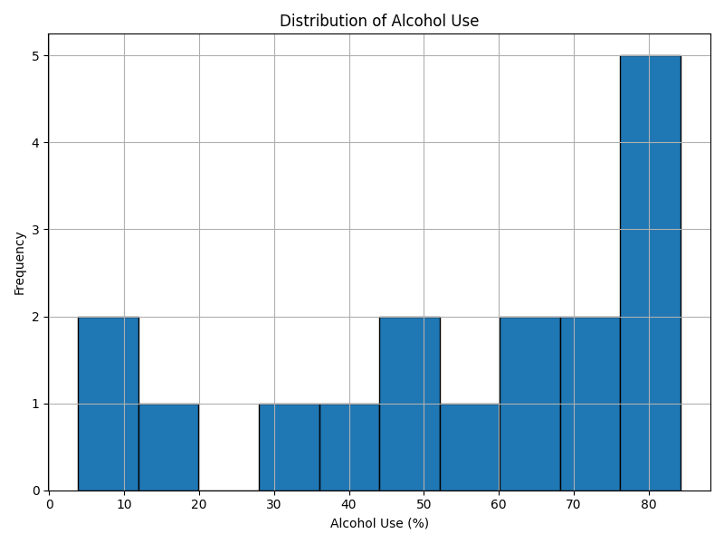
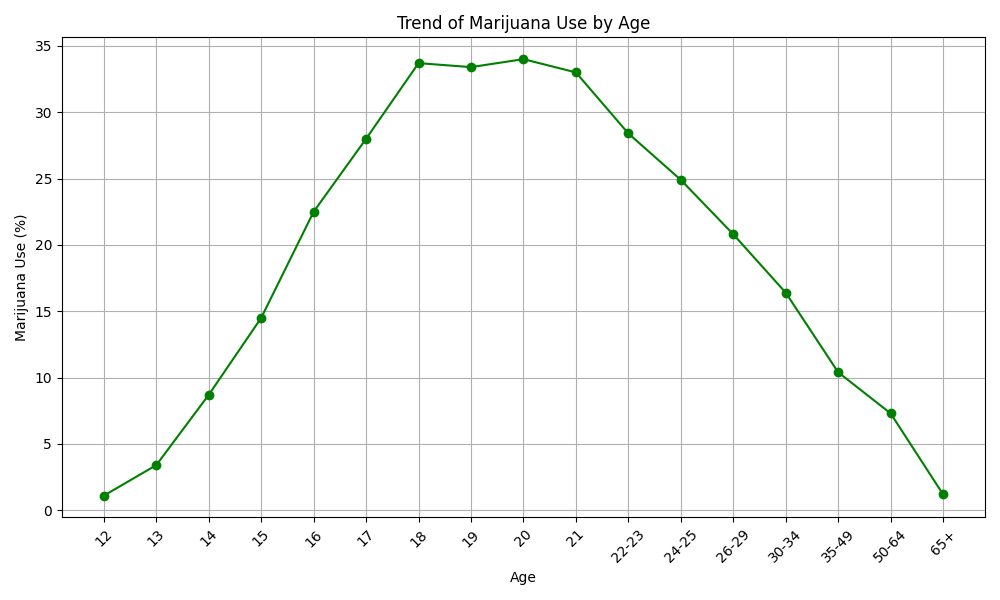
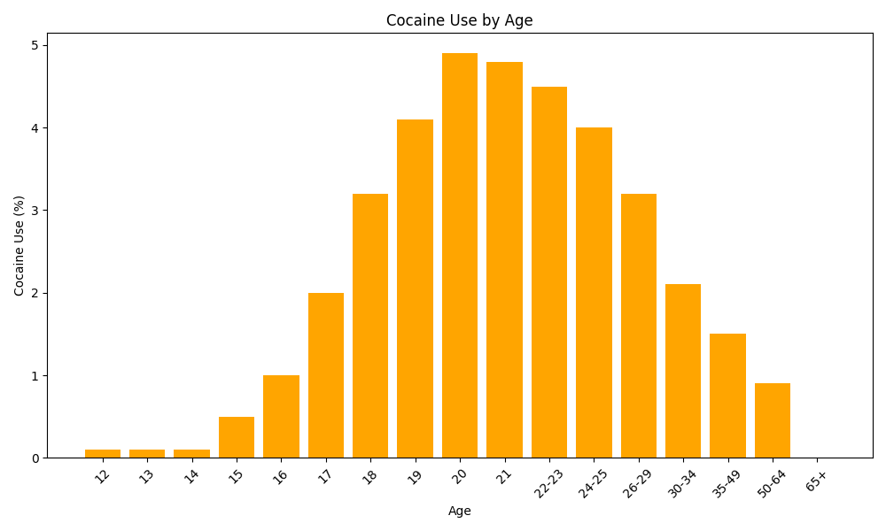

# Dataset Statistics
|    | statistic   | age   |       n |   alcohol_use |   alcohol_frequency |   marijuana_use |   marijuana_frequency |   cocaine_use | cocaine_frequency   |   crack_use | crack_frequency   |   heroin_use | heroin_frequency   |   hallucinogen_use |   hallucinogen_frequency |   inhalant_use | inhalant_frequency   |   pain_releiver_use |   pain_releiver_frequency |   oxycontin_use | oxycontin_frequency   |   tranquilizer_use |   tranquilizer_frequency |   stimulant_use |   stimulant_frequency |   meth_use | meth_frequency   |   sedative_use |   sedative_frequency |
|---:|:------------|:------|--------:|--------------:|--------------------:|----------------:|----------------------:|--------------:|:--------------------|------------:|:------------------|-------------:|:-------------------|-------------------:|-------------------------:|---------------:|:---------------------|--------------------:|--------------------------:|----------------:|:----------------------|-------------------:|-------------------------:|----------------:|----------------------:|-----------:|:-----------------|---------------:|---------------------:|
|  0 | count       | 17    |   17    |       17      |             17      |         17      |               17      |      17       | 17                  |   17        | 17                |    17        | 17                 |           17       |                 17       |      17        | 17                   |            17       |                   17      |       17        | 17                    |           17       |                  17      |        17       |               17      |  17        | 17               |      17        |              17      |
|  1 | null_count  | 0     |    0    |        0      |              0      |          0      |                0      |       0       | 0                   |    0        | 0                 |     0        | 0                  |            0       |                  0       |       0        | 0                    |             0       |                    0      |        0        | 0                     |            0       |                   0      |         0       |                0      |   0        | 0                |       0        |               0      |
|  2 | mean        |       | 3251.06 |       55.4294 |             33.3529 |         18.9235 |               42.9412 |       2.17647 |                     |    0.294118 |                   |     0.352941 |                    |            3.39412 |                  8.41176 |       1.38824  |                      |             6.27059 |                   14.7059 |        0.935294 |                       |            2.80588 |                  11.7353 |         1.91765 |               31.1471 |   0.382353 |                  |       0.282353 |              19.3824 |
|  3 | std         |       | 1297.89 |       26.8789 |             21.3188 |         11.9598 |               18.3626 |       1.81677 |                     |    0.235772 |                   |     0.333762 |                    |            2.79251 |                 15.0002  |       0.927283 |                      |             3.16638 |                    6.9351 |        0.608216 |                       |            1.75338 |                  11.4852 |         1.40767 |               85.9738 |   0.262762 |                  |       0.138    |              24.8335 |
|  4 | min         | 12    | 2223    |        3.9    |              3      |          1.1    |                4      |       0       | -                   |    0        | -                 |     0        | -                  |            0.1     |                  2       |       0        | -                    |             0.6     |                    7      |        0        | -                     |            0.2     |                   4.5    |         0       |                2      |   0        | -                |       0        |               3      |
|  5 | 25%         |       | 2469    |       40.1    |             10      |          8.7    |               30      |       0.5     |                     |    0        |                   |     0.1      |                    |            0.6     |                  3       |       0.6      |                      |             3.9     |                   12      |        0.4      |                       |            1.4     |                   6      |         0.6     |                7      |   0.2      |                  |       0.2      |               6.5    |
|  6 | 50%         |       | 2798    |       64.6    |             48      |         20.8    |               52      |       2       |                     |    0.4      |                   |     0.2      |                    |            3.2     |                  3       |       1.4      |                      |             6.2     |                   12      |        1.1      |                       |            3.5     |                  10      |         1.8     |               10      |   0.4      |                  |       0.3      |              10      |
|  7 | 75%         |       | 3058    |       77.5    |             52      |         28.4    |               52      |       4       |                     |    0.5      |                   |     0.6      |                    |            5.2     |                  4       |       2        |                      |             9       |                   15      |        1.4      |                       |            4.2     |                  11      |         3       |               12      |   0.6      |                  |       0.4      |              17.5    |
|  8 | max         | 65+   | 7391    |       84.2    |             52      |         34      |               72      |       4.9     | 8                   |    0.6      | 9                 |     1.1      | 88                 |            8.6     |                 52       |       3        | 5                    |            10       |                   36      |        1.7      | 7                     |            5.4     |                  52      |         4.1     |              364      |   0.9      | 54               |       0.5      |             104      |
## Median Values
|    |    n |   alcohol_use |   alcohol_frequency |   marijuana_use |   marijuana_frequency |   cocaine_use |   cocaine_frequency |   crack_use |   crack_frequency |   heroin_use |   heroin_frequency |   hallucinogen_use |   hallucinogen_frequency |   inhalant_use |   inhalant_frequency |   pain_releiver_use |   pain_releiver_frequency |   oxycontin_use |   oxycontin_frequency |   tranquilizer_use |   tranquilizer_frequency |   stimulant_use |   stimulant_frequency |   meth_use |   meth_frequency |   sedative_use |   sedative_frequency |
|---:|-----:|--------------:|--------------------:|----------------:|----------------------:|--------------:|--------------------:|------------:|------------------:|-------------:|-------------------:|-------------------:|-------------------------:|---------------:|---------------------:|--------------------:|--------------------------:|----------------:|----------------------:|-------------------:|-------------------------:|----------------:|----------------------:|-----------:|-----------------:|---------------:|---------------------:|
|  0 | 2798 |          64.6 |                  48 |            20.8 |                    52 |             2 |                   5 |         0.4 |                 6 |          0.2 |                 50 |                3.2 |                        3 |            1.4 |                    4 |                 6.2 |                        12 |             1.1 |                    12 |                3.5 |                       10 |             1.8 |                    10 |        0.4 |               24 |            0.3 |                   10 |
## Visualizations
### Alcohol Use Histogram

### Marijuana Use Line Chart

### Cocaine Use Bar Chart

